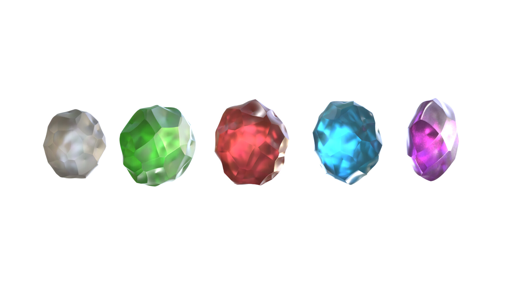

# Hello! :)

My name’s Adam, I’m an junior animator based in Prague. I can speak Czech, English and German & I also study French.

<!-- This is a comment, only visible to the author: Add a link to your presentation. -->
<!-- Presentations do not need to be a PDF, you may link elsewhere, such as Figma, YouTube, etc. -->
<!-- Consider adding navigation to each section (About, Featured Projects, Notes, etc.) -->

- [View Presentation](#featured-projects)<!-- Add helpful hint as to what kind of file or destination is here. -->
- [About](#something-about-me)
- [Featured Projects](#featured-projects)

## something about me

My interesterest are revolving around things that inspire me. I like aesthetically pleasing things.
I am trying to see beauty in everyday stuff.   

<!-- Consider including a headshot. We’re not designing, so keep the image width/height around 320px x 320px (square). Replace "surname" with your surname in the file name. -->

I love a good cup of coffee and tattoos of any kind. I enjoy playing fps games, I occasionally go to gym, spend time with friends, have a deep talks about life. When I am not studying, I am working as customer care specialist. It is very tiring work, cause all you do is take care of people who don not know how to do 3 simple clicks.

## Featured Projects
As I search for my future path, I explore different practices and sample a little of everything to discover my true purpose. Here are a few examples of my work, each reflecting my evolving skills and artistic identity. As I navigate the possibilities, I stay open to new opportunities and eagerly anticipate the next chapters of my creative process.

## - GRAPHICS
Diving into the vibrant world of colour has always been a joy for me. Whether it's the vibrant hues of a sunset or the bold tones in a busy city, I find inspiration everywhere. In fact, I'd like to share an example of my work with you - a random image I came across on Pinterest that I couldn't resist editing. I believe that colors have the power to evoke emotions and tell stories.

My journey with the world of Photoshop started at the age of 12. It became my artistic playground, a space where I could experiment, learn and push the boundaries of my creativity. Over the years, my skills with Photoshop have grown and allowed me to turn ordinary images into vibrant art.

Looking back on these formative years, I realize that my journey with Photoshop was not just about learning a software tool, but developing an artistic language.

The pictures on the left show some mock-up print designs for the T-shirt. This is just a draft, nothing finished.  

Here is how the mockup of the tshirt could look in real life. 

## - ANIMATION
I've crafted a collection that showcases my evolving style and creative expressions.
Inspired by the dynamic interplay of visuals, I aim to work and expand my distinctive animation style.

!!Please note, that one of the animation might trigger some sentitive individuals, who suffer from seizures.!! 

just a draft animation.  

Final animation with 16 images. 

lightning done, using also 16 images.

## - ART
I deeply appreciate simplicity and find beauty in the elegance of simple lines. As my passion for drawing progressed, I became interested in the intricate art of tattooing. It is fascinating how each tattoo can tell a unique story and reflect the personality and experiences of its wearer.

As I continue to explore the world of tattooing, I am playing with the idea of taking this passion to the next level. I have cultivated a desire to delve into this field and start tattooing myself. The idea of creating permanent works of art on canvas skin fascinates me and I look forward to embarking on this artistic journey.

Although my journey to tattooing is in its beginning stages, I am eager to improve my skills and express my creativity through this unique art form.

My passion for drawing and the world of tattooing has become an integral part of my artistic identity and I am excited to see where this creative journey will take me next.

simple drawing, capturing the body with few simple lines

some of tattoo ideas, that I liked.

one line tulip drawing.

## - 3D
The last part of my portfolio is dedicated to 3D. Although it has a certain place in my creative journey, I must admit that it doesn't resonate with me as strongly as my other works. Personally, I find a deep connection with the expressive freedom that 2D animation offers, and it holds a special place in my heart. However, because I realise the importance of exploring different media, I also embarked on 3D.

While not my main focus, I believe that experimenting with different forms and techniques adds to the overall richness of my artistic portfolio. Here are some of my 3D work for my animation atelier.

5 stones, each one representing a different element

One of the stones on the table, done for my exam

Stones emitting light, also done for my exam

