# First Impression

<!-- This is a comment, only visible to the author: Add a link to your presentation. -->
<!-- Presentations do not need to be a PDF, you may link elsewhere, such as Figma, YouTube, etc. -->
<!-- Consider adding navigation to each section (About, Featured Projects, Notes, etc.) -->

- [View Presentation](img/neonblue.png) (PDF) <!-- Add helpful hint as to what kind of file or destination is here. -->
- [About](#about)
- [Featured Projects](#featured-projects)
- [Notes](#notes)

## About ADAM
Hello, I am a storyteller and wannabe character designer.
My interesterest are revolving around games and movies. I like living inside my head.
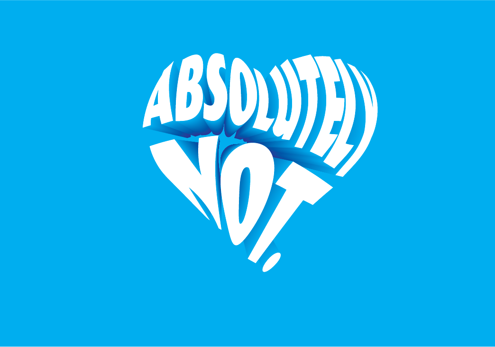

<!-- Consider including a headshot. We’re not designing, so keep the image width/height around 320px x 320px (square). Replace "surname" with your surname in the file name. -->

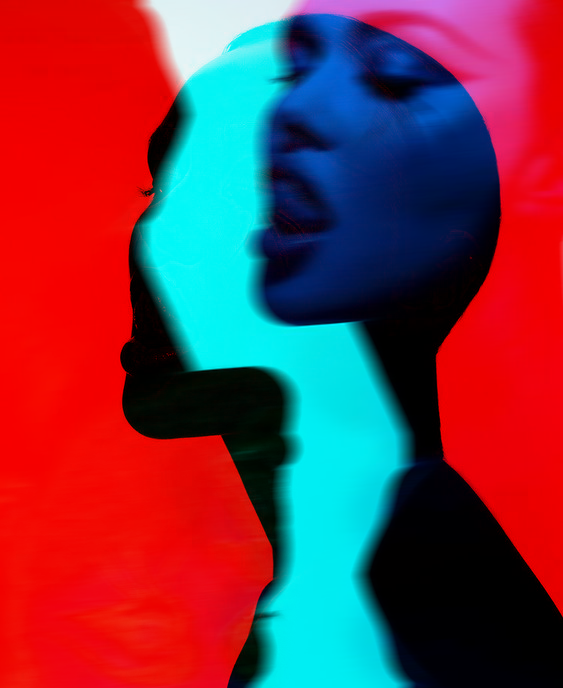

I love a good cup of coffee and interesting tattoos. I occasionaly go to gym, spend time with friends, have a deep talks about life. 
A short description about yourself. Think — alt text description length, a max of 125 characters, short and sweet. If you go over, that’s okay — edits are free.

## Featured Projects
Since I still do not know what I wanna do in the future, I am trying many things. Here are some examples of my work c:

## graphics
Editing in photoshop of this random blue girl I found on pinterest.
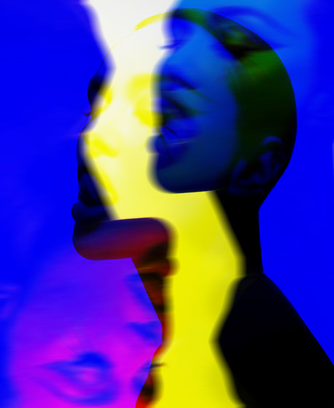

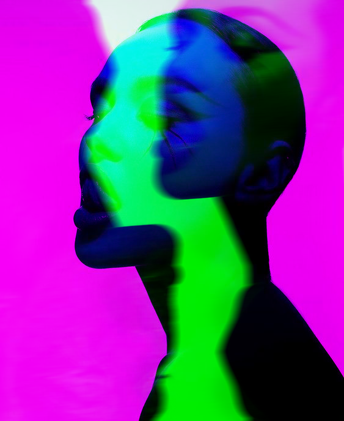
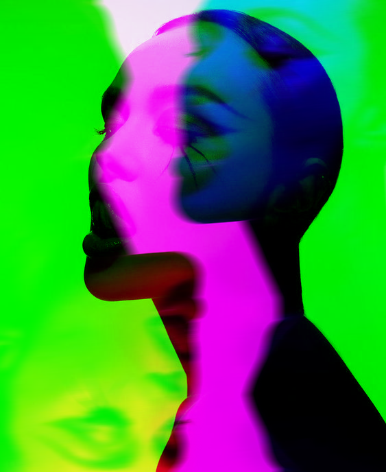
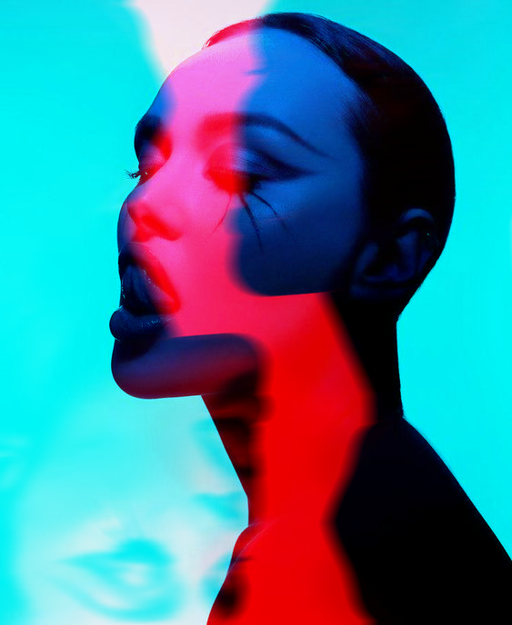
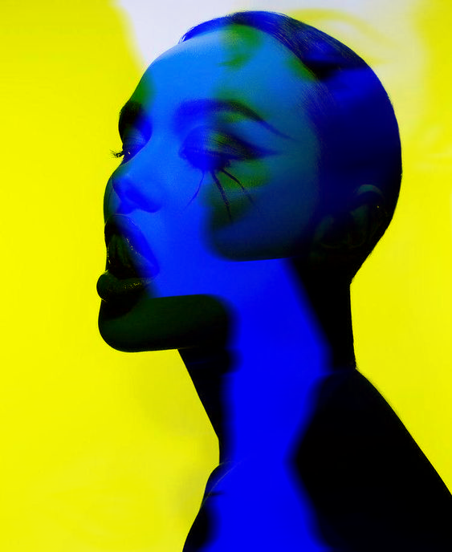
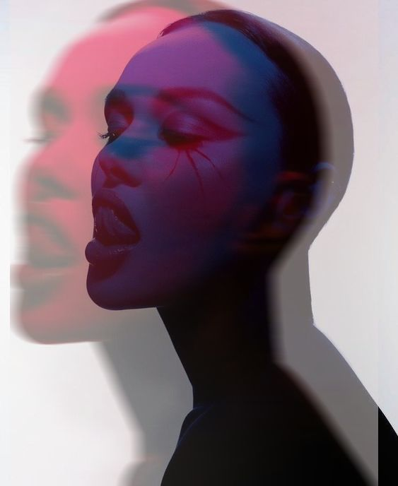

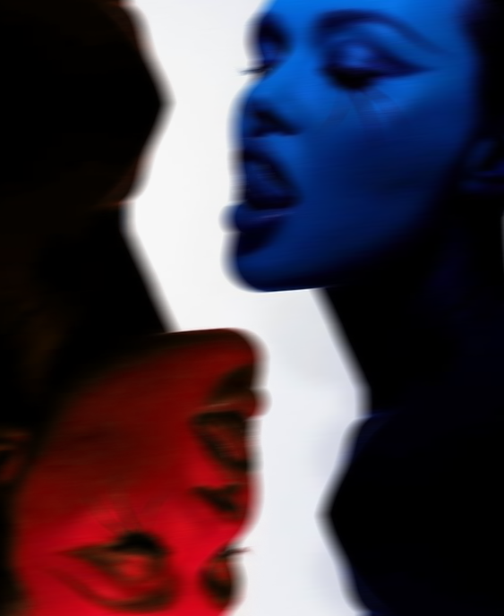

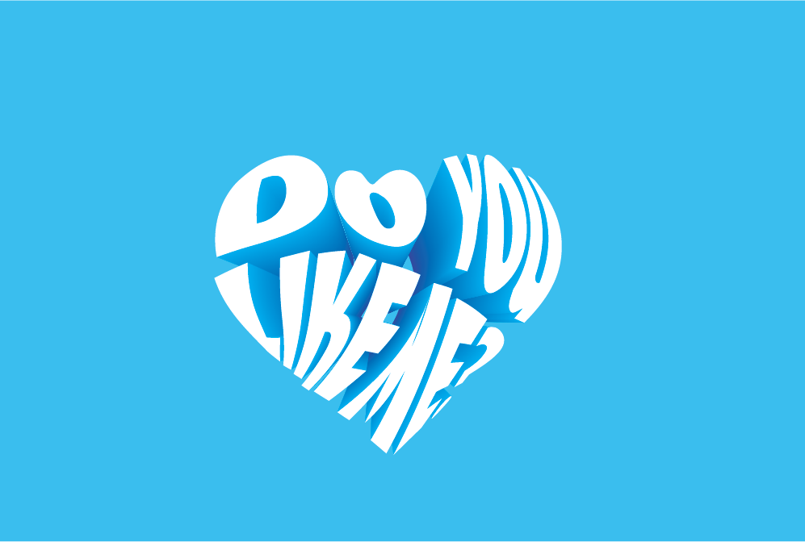

## 3D
Since I really like animated series about 5 girls wielding elemental powers, I tried creating a rock that would each character have.
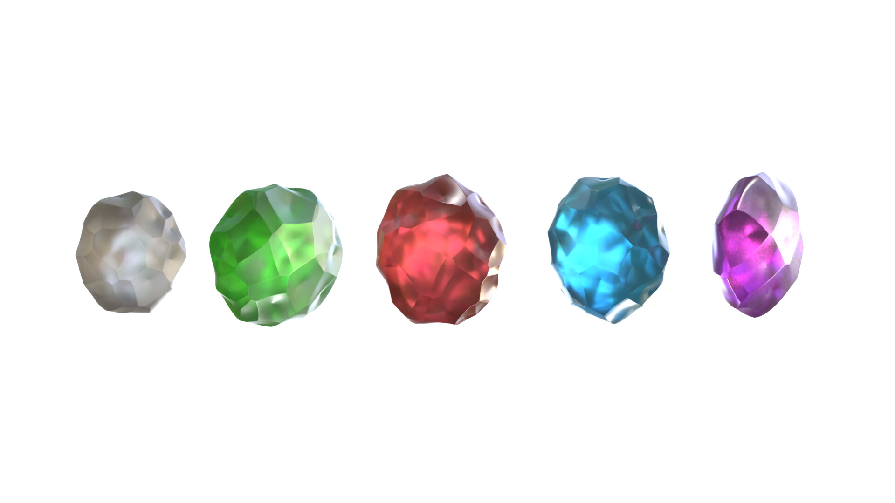
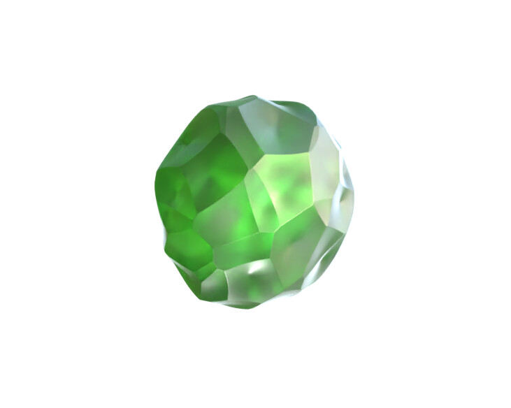
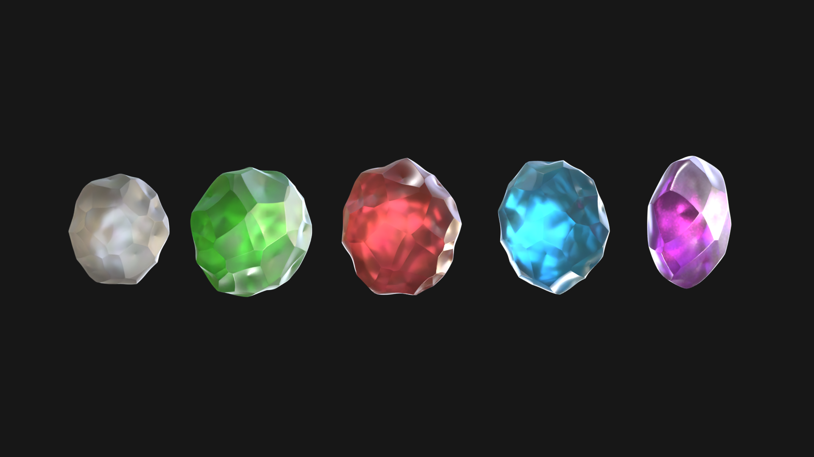
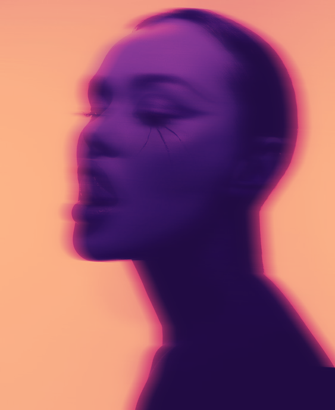
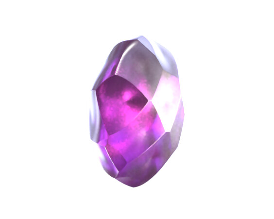
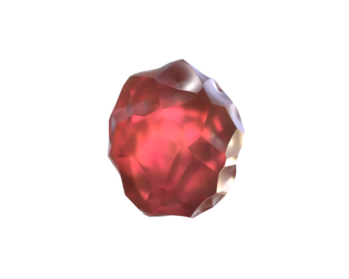
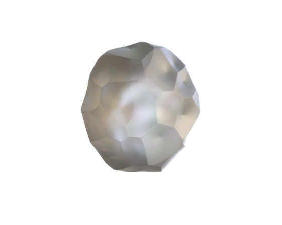
## art
Some basic doodles.

## animation

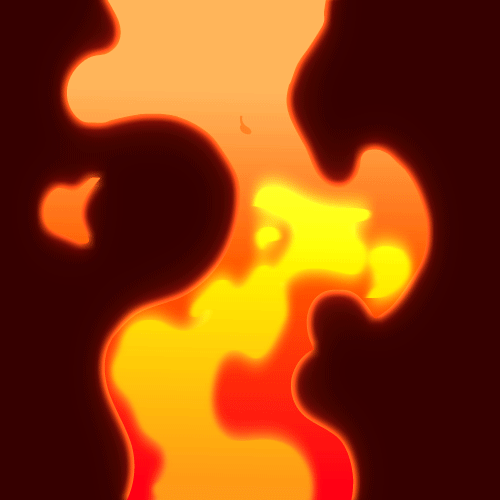
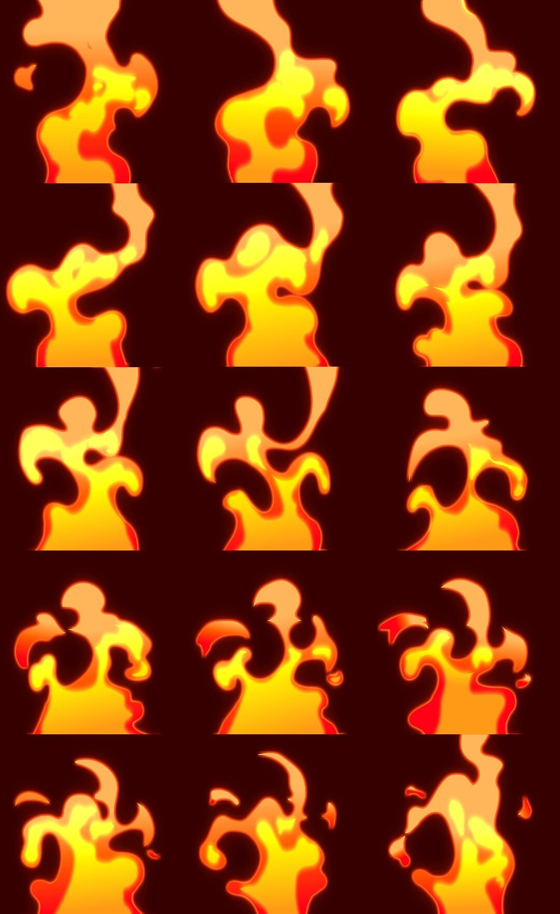

### Featured Project Fire momevement 

<!-- Use a static poster image or animated GIF, but no video files. Again, keep the image width/height manageable, around 1280x x 720px (16:9 aspect ratio), or a max-width of 1280px. -->

(img/draftfire.gif)
(img/firesteps.jpg)

- A short description about the project — *the what*.
- A short description about the significance of the project — *the whys*.
- A short description about the outcome of the project — *the result or takeaway*.

<!-- Use the same stucture above for the rest of your featured projects. -->

## Notes

Numbered comments about each featured project as presenter notes or speaking points.

1. …
2. …
3. …
<!-- And so on. -->
