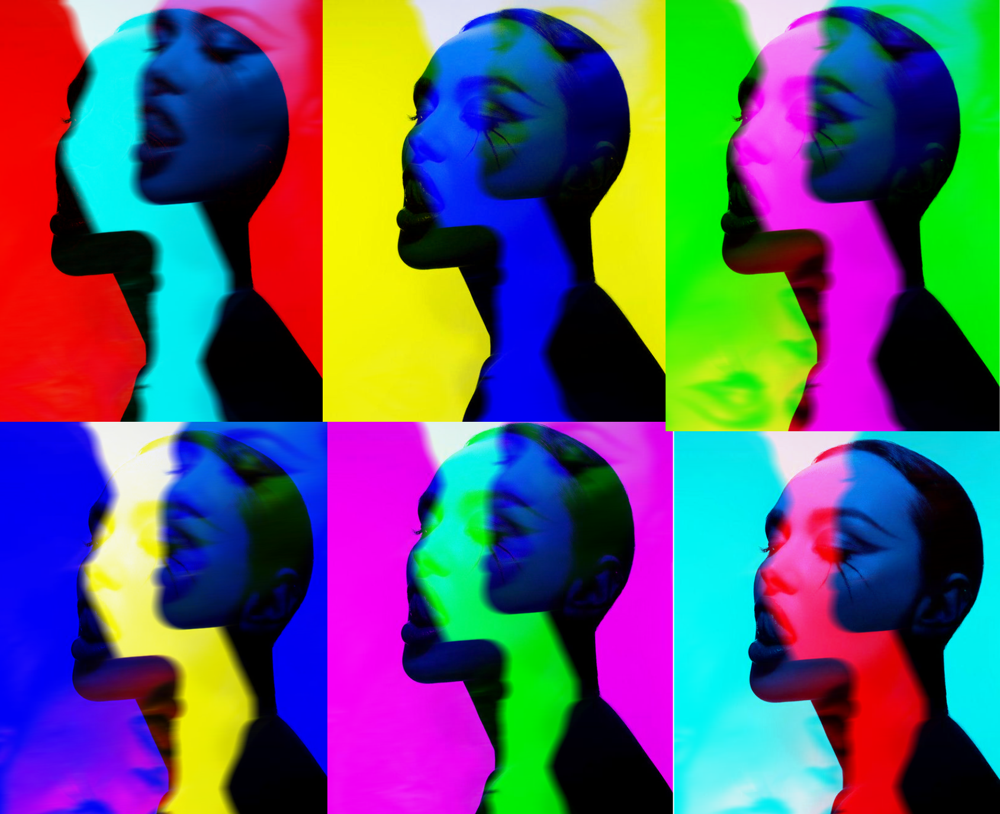
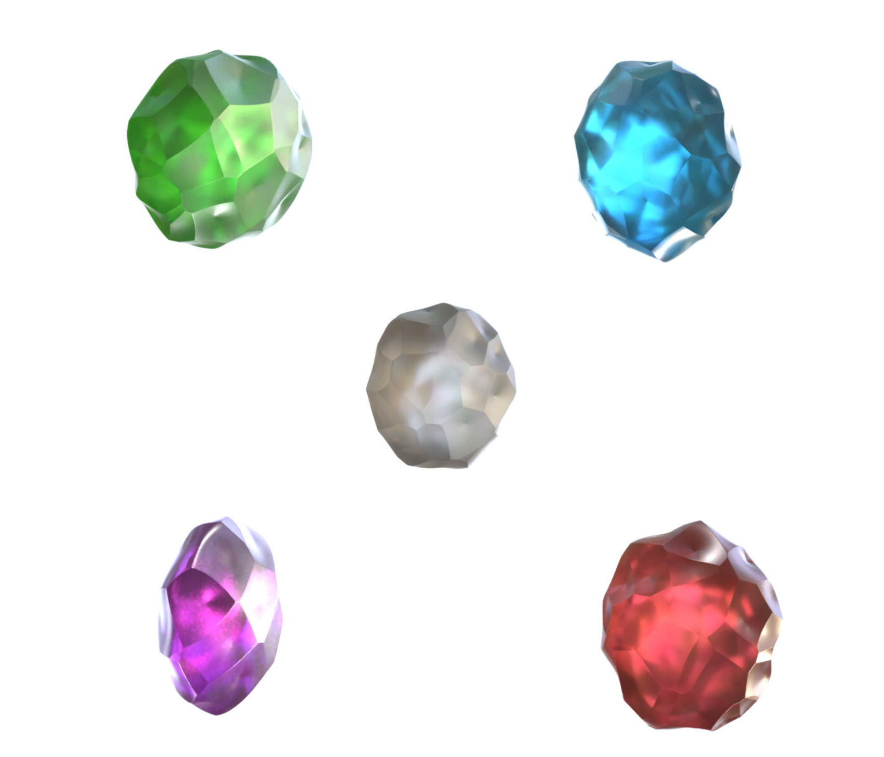

# first impression

<!-- This is a comment, only visible to the author: Add a link to your presentation. -->
<!-- Presentations do not need to be a PDF, you may link elsewhere, such as Figma, YouTube, etc. -->
<!-- Consider adding navigation to each section (About, Featured Projects, Notes, etc.) -->

- [View Presentation](img/neonblue.png) (PDF) <!-- Add helpful hint as to what kind of file or destination is here. -->
- [About](#about-me)
- [Featured Projects](#featured-projects)
- [Notes](#notes)

## About me

Hello, my interesterest are revolving around things that inspire me. I like aesthetically pleasing things.
I am trying to see beauty in everyday stuff. It is very hard to describe myself in just a few sentences. 
It is your turn now to make an opinion about me.  

<!-- Consider including a headshot. We’re not designing, so keep the image width/height around 320px x 320px (square). Replace "surname" with your surname in the file name. -->

I love a good cup of coffee and tattoos of any kind. I enjoy playing fps games, I occasionaly go to gym, spend time with friends, have a deep talks about life. When I am not studying, I am working as customer care specialist. It is very tiring work, cause all you do is take care of people who don not know how to do 3 simple clicks.

I would say I am trying a bit from everything. 

## Featured Projects
Since I still do not know what I wanna do in the future, I am trying a bit of everything. 

Here are some examples of my work.

## graphics

## 3D

## art

## animation

### Featured Project

<!-- Use a static poster image or animated GIF, but no video files. Again, keep the image width/height manageable, around 1280x x 720px (16:9 aspect ratio), or a max-width of 1280px. -->

- A short description about the project — *the what*.
- A short description about the significance of the project — *the whys*.
- A short description about the outcome of the project — *the result or takeaway*.

<!-- Use the same stucture above for the rest of your featured projects. -->

## Notes

Numbered comments about each featured project as presenter notes or speaking points.

1. …
2. …
3. …
<!-- And so on. -->
