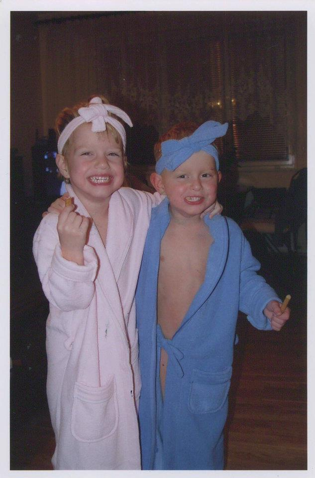
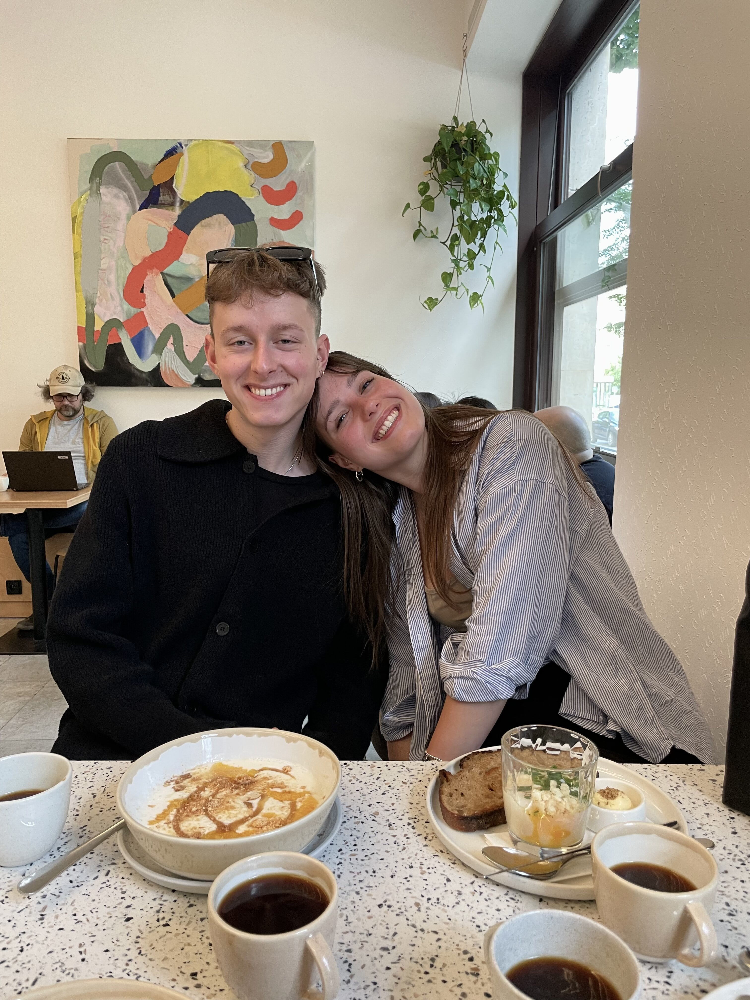
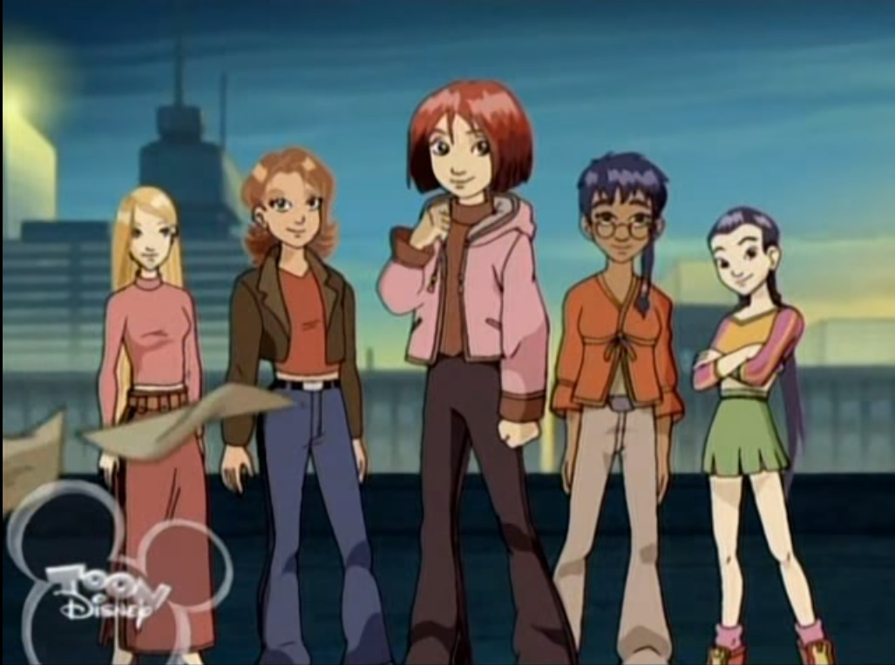
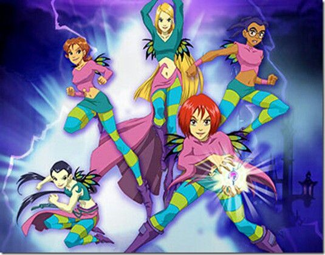
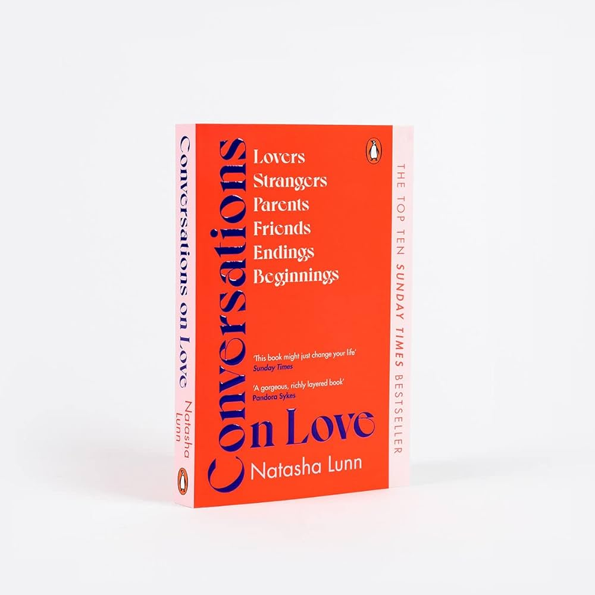

# MY INTERESTS DURING MY LIFE
by Adam Vojtěch

Audio version ()//to be added

Slides ()//to be added

Hi there, I'm Adam! I thought I'd take a moment to share a little bit about myself and the journey that has shaped who I am today. I have picked a few highlights from my life, things I've enjoyed, to give you an insight into the evolution of my interests. .

## EARLY LIFE

I was always seen as the friendly, approachable kid, known for striking up conversations with strangers while waiting for a doctor's appointment or simply wandering through the shopping mall. 

I would not say that much has changed, it is just I am shy now.

I was born on a leap year, my birthday is around every four years. When there is no 29th of February, we celebrate either on February 28th or March 1st.
Fortunately, I share this unique birthday "curse" with one other person in my life — my twin sister. 

_me and my sister celebrating the 21st birthday together_

## MY ENGLISH JOURNEY

My English journey began in preschool, where I had the privilege of learning from a patient and engaging native speaker who taught us colors and numbers. After that initial english backround knowledge, there was a pause until I turned 8 when English classes became a regular part of our school curriculum. 

Upon completing elementary school, I enrolled in a high school with a focus on languages. Given the choice of Spanish, French, German, Russian, and Chinese, I chose German as my second language. My decision was influenced by the fact that I had already been learning German since 7th grade.

Iam truly grateful for the fluency I've achieved in English. While some might consider it a common skill, the more people I meet, the more I realize that fluency in English isn't as common as one might assume. 

## GREEK MYTHOLOGY

The first interest I'd like to dive into is Greek Mythology. I was obssesed with it. It started when we were in Greece for a summer holiday. Me and my mom went to a random greek bookstore and we found one book in czech. The book was about greek mythology. Because there was not much to do I started reading and I got so into it that when I came back home, I started also reading things online, watch videos and other narratives. I still like it, no matter what, just not as much anymore.
Some known ones are:
- Hypnos : god of sleep
- Helios : god of sun
- Selene : goddess of the moon

## HANNAH MONTANA
Following my obsession with Greek mythology, my interests took a turn as I discovered the world of "Hannah Montana" and its star, Miley Cyrus. It was during my childhood, around the age of 8, when I found the Disney series about the double life of an ordinary student with a secret - being a pop star.

FUN FACT: At the same time, while I was diving into the world of "Hannah Montana," my sister was obsessed with another Disney phenomenon, "High School Musical." 

This obsession with "Hannah Montana" extended beyond the screen into my everyday life. I had bed coushions with Hannah Montana, Towels, and even school supplies such as notebooks and pencil cases. 

## FASCINATION WITH GAMES
When I was 7 years old my parents gave my a playstation 1 for my birthday. At the time I didn't know much english so playing the games without the ability to read much or even understanding what am I supposed to do was pretty hard, not gonna lie. But I have got my hang of it. After that wehn I was around 10 I have got a new xbox from my grandma. Eventually this fascination (my parents call it addiction) with games shifted as I grew older and needed my own pc. I started playing pc games, such as minecraft and league of legends. Now I play almost only FPS- first person shooter games, such as Apex Legends or Overwatch 2.

## BEING CREATIVE
Another thing apart from gaming and obsessing over weird stuff is being creative. I really enjoy the creative process of making things. When I was younger I was going to ceramics course with my sister. Now I'd like to get back into it. In my plans is also creating my own rug ( it is called tufting ). Recently I have been cutting beer bottles, so I have created nice glasses. It is harder then it seems because keeping the cutting line straight is really hard. Apart from these things I would really like to get a tattoo course, since I have many tattoos myself.

## AVATAR THE LAST AIRBENDER
The one series that really got my heart is ATLA. Not the one on netflix, but the original animated one. I love the storyline and the bending of elements. I also really like the animation style, that seems somehow very basic, but nice. This fascination with elements comes from early age, when I loved the series called W.I.T.C.H., which is about five girls where each one wield a single element (water, fire, earth, wind). This show was really ahead of its time, since they showed all the races and also sexualities. It saddens me to this day, that the show didnt get additional series, eventho the comic did. 

- will : power over electricity, also a leader of the group, has the ''heart''
- irma : power over water
- taranee: power over fire
- cornelia: power over earth
- haylin: power over air
  
  
  

## BOOK - CONVERSTAIONS ON LOVE
The books I read now are in focus on self-development, helping me in my journey of personal growth. Recently, I completed a book titled 'Conversations on Love, by Natasha Lunn,  which I found truly remarkable. I highly recommend it to anyone struggling with issues of self-love and the pressure to find romantic fulfillment. This book has truly helped me navigate my own self-love journey. It has provided insights into reframing perspectives on relationships and love in general.

If you think this book might be interested, here are two other that you can check out:
- Everthing I know about love by Dolly Alderton
- Things we don't talk about by Pandora Owl

